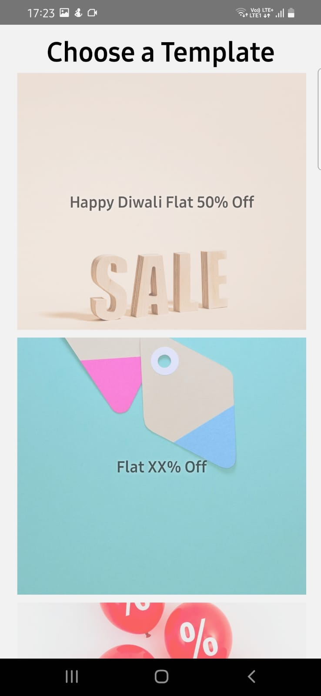
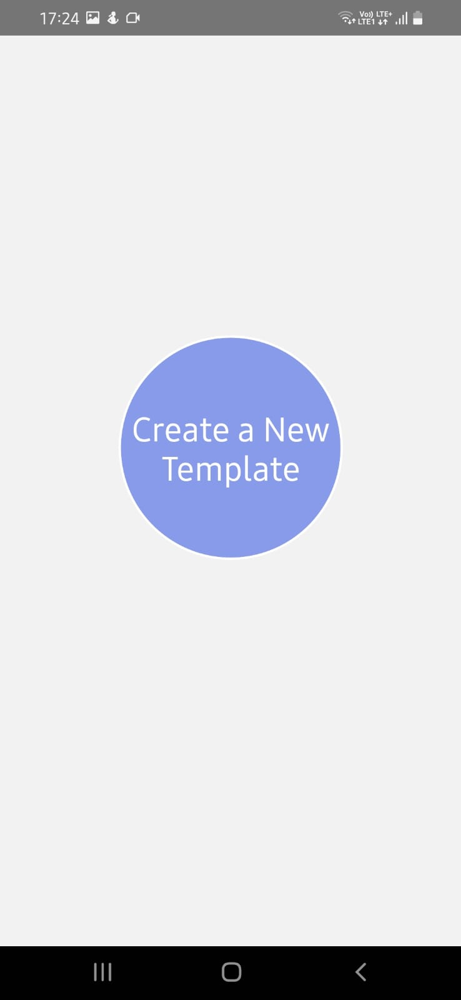
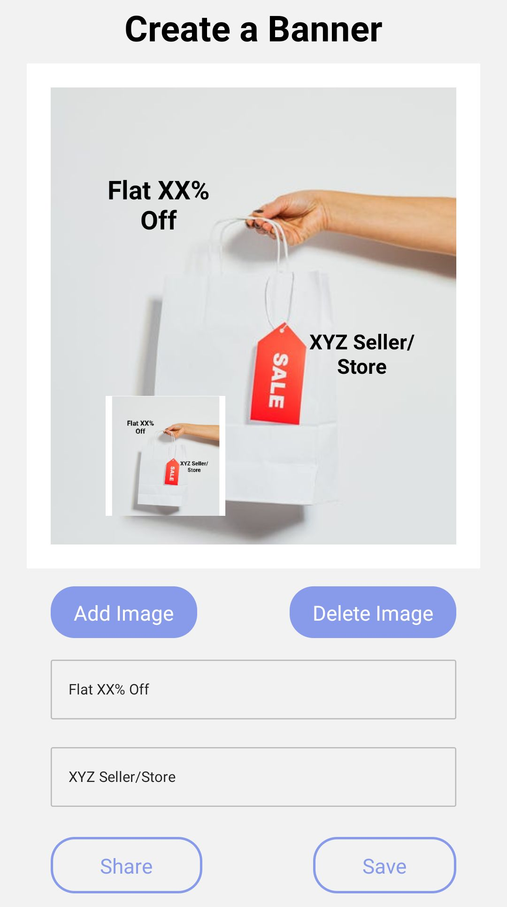
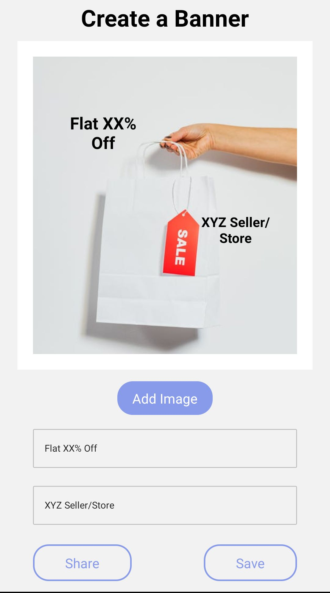

# Templify

An Android Application for creating banners by importing images and writing 
draggable text over images. Added functionality of saving the banner in gallery
and sharing it via social media.


## Tech Stack

***React-Native, JavaScript, CSS***


## Run Locally

Clone the project

```bash
  git clone https://github.com/theydvgaurav/Templify
```

Go to the project directory

```bash
  cd Templify
```

Install dependencies

```bash
  npm install
```
Start the Metro

```bash
  npx react-native start
```
Start the application

```bash
  npx react-native run-android
```


## Screenshots

<div align="center">
     
    
     
    
     
</div>

